# 🃏 Planning Poker

Uma aplicação Flutter multiplataforma para sessões de Planning Poker em tempo real, construída com **Clean Architecture**, **MVVM** e **Firebase Realtime Database**.


## 📋 Índice

- [Sobre o Projeto](#-sobre-o-projeto)
- [Funcionalidades](#-funcionalidades)
- [Arquitetura](#-arquitetura)
- [Padrões de Projeto](#-padrões-de-projeto)
- [Estrutura de Pastas](#-estrutura-de-pastas)
- [Tecnologias](#-tecnologias)
- [Como Executar](#-como-executar)
- [Diagramas](#-diagramas)
- [Testes](#-testes)
- [Contribuição](#-contribuição)

---

## 🎯 Sobre o Projeto

**Planning Poker** é uma técnica de estimativa ágil usada por equipes de desenvolvimento para estimar o esforço de tarefas. Esta aplicação permite que equipes realizem sessões de Planning Poker de forma remota e em tempo real.

### Por que este projeto?

- ✅ Demonstração de **arquitetura limpa** em Flutter
- ✅ Implementação de **padrões de projeto** modernos
- ✅ Sincronização em **tempo real** com Firebase
- ✅ Código **testável** e **manutenível**
- ✅ Suporte **multiplataforma** (Android, iOS, Web, Windows, macOS, Linux)

---

## ✨ Funcionalidades

### Para o Host (Facilitador)
- 🎲 Criar nova sessão de Planning Poker
- 🔑 Compartilhar código da sessão (6 caracteres)
- 👁️ Revelar todas as cartas simultaneamente
- 🔄 Resetar rodada para nova estimativa
- 🚪 Encerrar sessão (remove todos os participantes)

### Para Participantes
- 🚪 Entrar em sessão existente via código
- 🃏 Selecionar carta de estimativa
- 👥 Ver outros participantes em tempo real
- 📊 Ver resultados após revelação

### Cartas Disponíveis
```
0, 1, 2, 3, 5, 8, 13, 21, 34, 55, 89, ?, ☕
```
*Baseado na sequência de Fibonacci + cartas especiais*

---

## 🏗️ Arquitetura

O projeto segue os princípios da **Clean Architecture** combinada com o padrão **MVVM** (Model-View-ViewModel) na camada de apresentação.

### Camadas

```
┌─────────────────────────────────────────────────────────┐
│                   PRESENTATION LAYER                     │
│  ┌─────────┐  ┌─────────────┐  ┌─────────┐  ┌────────┐  │
│  │  Views  │──│  ViewModels │──│ States  │──│Commands│  │
│  └─────────┘  └─────────────┘  └─────────┘  └────────┘  │
└────────────────────────┬────────────────────────────────┘
                         │
┌────────────────────────▼────────────────────────────────┐
│                     DOMAIN LAYER                         │
│  ┌──────────┐  ┌──────────────┐  ┌───────────────────┐  │
│  │ Entities │  │   Use Cases  │  │ Repository (intf) │  │
│  └──────────┘  └──────────────┘  └───────────────────┘  │
└────────────────────────┬────────────────────────────────┘
                         │
┌────────────────────────▼────────────────────────────────┐
│                      DATA LAYER                          │
│  ┌───────────────────┐  ┌─────────────────────────────┐ │
│  │ Repository (impl) │──│      Data Sources           │ │
│  └───────────────────┘  └─────────────────────────────┘ │
└────────────────────────┬────────────────────────────────┘
                         │
                         ▼
              ┌─────────────────────┐
              │  Firebase Realtime  │
              │      Database       │
              └─────────────────────┘
```

### Princípios Aplicados

| Princípio | Aplicação |
|-----------|-----------|
| **Single Responsibility** | Cada classe tem uma única responsabilidade |
| **Open/Closed** | Extensível via interfaces, fechado para modificação |
| **Liskov Substitution** | Repositórios implementam interfaces do domínio |
| **Interface Segregation** | Interfaces específicas por contexto |
| **Dependency Inversion** | Camadas superiores não dependem de inferiores |

---

## 🎨 Padrões de Projeto

### 1. MVVM (Model-View-ViewModel)

A camada de apresentação utiliza MVVM para separar lógica de UI da lógica de negócio.

```dart
// View observa ViewModel
final viewModel = context.watch<HomeViewModel>();

// ViewModel expõe estado
HomeState get state => _state;

// ViewModel emite novos estados
void _emit(HomeState state) {
  _state = state;
  notifyListeners();
}
```

**Componentes:**
- **View** (`HomeScreen`, `GameScreen`) - UI declarativa
- **ViewModel** (`HomeViewModel`, `GameViewModel`) - Gerencia estado e lógica
- **State** (`HomeState`, `GameScreenState`) - Representa estado da UI

### 2. Command Pattern

Commands encapsulam operações assíncronas com gerenciamento de loading/erro.

```dart
class CreateSessionCommand extends ObservableCommand<Session?> {
  CreateSessionCommand({
    required CreateSessionUseCase useCase,
    required this.sessionName,
    required this.host,
  }) : super(() async {
    final result = await useCase.execute(...);
    return result.when(
      success: (session) => session,
      failure: (message) => throw Exception(message),
    );
  });
}
```

**Benefícios:**
- ✅ Encapsula lógica de execução
- ✅ Gerencia estados de loading/erro automaticamente
- ✅ Reutilizável entre ViewModels
- ✅ Testável isoladamente

### 3. Repository Pattern

Abstrai a fonte de dados do domínio.

```dart
// Interface no domínio
abstract class SessionRepository {
  Future<Session> createSession({required String name, required Player host});
  Stream<Session?> watchSession(String sessionId);
  // ...
}

// Implementação na camada de dados
class FirebaseSessionRepository implements SessionRepository {
  final FirebaseSessionDataSource _dataSource;
  // ...
}
```

### 4. Result Pattern (Either-like)

Tratamento explícito de sucesso e falha.

```dart
sealed class Result<T> {
  factory Result.success(T data) = Success<T>;
  factory Result.failure(String message) = Failure<T>;
  
  R when<R>({
    required R Function(T data) success,
    required R Function(String message) failure,
  });
}

// Uso
final result = await useCase.execute(...);
return result.when(
  success: (session) => session,
  failure: (message) => throw Exception(message),
);
```

### 5. Sealed Classes (Discriminated Unions)

Estados da UI como tipos discriminados.

```dart
sealed class HomeState {
  const HomeState();
}

class HomeInitial extends HomeState { }
class HomeLoading extends HomeState { }
class HomeError extends HomeState {
  final String message;
}
class HomeSuccess extends HomeState {
  final Session session;
  final Player player;
}
```

**Benefícios:**
- ✅ Exaustividade garantida pelo compilador
- ✅ Type-safe pattern matching
- ✅ Estados mutuamente exclusivos

### 6. Observer Pattern

Implementado via `ChangeNotifier` e `Provider`.

```dart
class GameViewModel extends ChangeNotifier {
  void _startWatchingSession() {
    _sessionSubscription = _watchSessionUseCase
        .execute(_session!.id)
        .listen((session) {
          _session = session;
          notifyListeners(); // Notifica observers
        });
  }
}
```

---

## 📁 Estrutura de Pastas

```
lib/
├── core/                          # Utilitários e configurações
│   ├── constants/                 # Constantes (cartas de poker)
│   │   └── poker_cards.dart
│   ├── di/                        # Injeção de dependência
│   │   └── dependency_injection.dart
│   ├── result/                    # Result pattern
│   │   └── result.dart
│   └── utils/                     # Utilitários
│       └── session_key_generator.dart
│
├── data/                          # Camada de dados
│   ├── datasources/               # Fontes de dados
│   │   └── firebase_session_datasource.dart
│   └── repositories/              # Implementações
│       └── firebase_session_repository.dart
│
├── domain/                        # Camada de domínio
│   ├── entities/                  # Entidades de negócio
│   │   ├── session.dart
│   │   ├── player.dart
│   │   └── played_card.dart
│   ├── repositories/              # Interfaces
│   │   └── session_repository.dart
│   └── usecases/                  # Casos de uso
│       ├── create_session_usecase.dart
│       ├── join_session_usecase.dart
│       ├── play_card_usecase.dart
│       ├── reveal_cards_usecase.dart
│       ├── reset_round_usecase.dart
│       ├── leave_session_usecase.dart
│       └── watch_session_usecase.dart
│
├── presentation/                  # Camada de apresentação
│   ├── commands/                  # Command pattern
│   │   ├── command.dart           # ObservableCommand base
│   │   ├── home_commands.dart     # Commands da Home
│   │   └── game_commands.dart     # Commands do Game
│   ├── state/                     # Estados da UI
│   │   ├── home_state.dart
│   │   └── game_state.dart
│   ├── viewmodels/                # ViewModels
│   │   ├── home_viewmodel.dart
│   │   └── game_viewmodel.dart
│   ├── views/                     # Telas
│   │   ├── home_screen.dart
│   │   ├── game_screen.dart
│   │   └── partials/              # Componentes de tela
│   └── widgets/                   # Widgets reutilizáveis
│
├── main.dart                      # Entry point
└── firebase_options.dart          # Config Firebase
```

---

## 🛠️ Tecnologias

### Framework & Linguagem
| Tecnologia | Versão | Descrição |
|------------|--------|-----------|
| Flutter | 3.9+ | Framework UI multiplataforma |
| Dart | 3.9+ | Linguagem de programação |

### Dependências Principais
| Pacote | Uso |
|--------|-----|
| `provider` | Gerenciamento de estado e DI |
| `firebase_core` | Core do Firebase |
| `firebase_database` | Realtime Database |
| `uuid` | Geração de IDs únicos |

### Dependências de UI
| Pacote | Uso |
|--------|-----|
| `google_fonts` | Fontes customizadas |
| `lottie` | Animações |
| `flip_card` | Animação de virar carta |
| `carousel_slider` | Carrossel de cartas |
| `skeletonizer` | Loading skeletons |

### Dev Dependencies
| Pacote | Uso |
|--------|-----|
| `flutter_test` | Testes unitários e de widget |
| `mockito` | Mocks para testes |
| `build_runner` | Geração de código |

---

## 🚀 Como Executar

### Pré-requisitos
- Flutter SDK 3.9+
- Dart SDK 3.9+
- Conta Firebase (para configurar Realtime Database)

### Configuração do Firebase

1. Crie um projeto no [Firebase Console](https://console.firebase.google.com/)
2. Configure o Realtime Database
3. Execute:
```bash
# Instalar FlutterFire CLI
dart pub global activate flutterfire_cli

# Configurar Firebase
flutterfire configure
```

Para mais detalhes, veja [FIREBASE_SETUP.md](FIREBASE_SETUP.md).

### Instalação

```bash
# Clone o repositório
git clone https://github.com/DanielBrown1998/planning_poker.git
cd planning_poker

# Instale as dependências
flutter pub get

# Execute o projeto
flutter run
```

### Build para Produção

```bash
# Android
flutter build apk --release

# iOS
flutter build ios --release

# Web
flutter build web --release

# Windows
flutter build windows --release
```

---

## 📊 Diagramas

Os diagramas do projeto estão organizados em `docs/diagrams/`:

```
docs/diagrams/
├── src/          # Arquivos fonte PlantUML (.puml)
└── images/       # Imagens geradas (.png)
```

### Visão Geral da Arquitetura

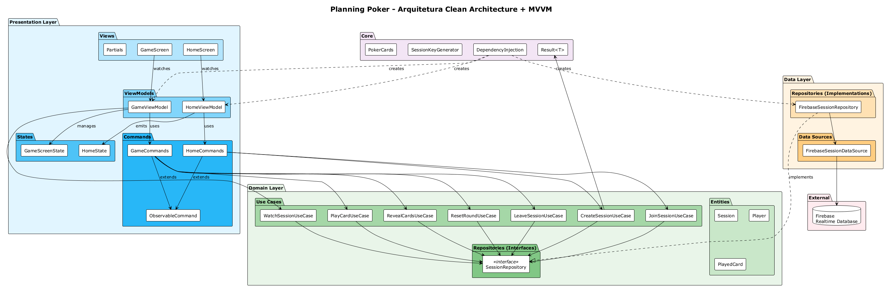

### Entidades do Domínio

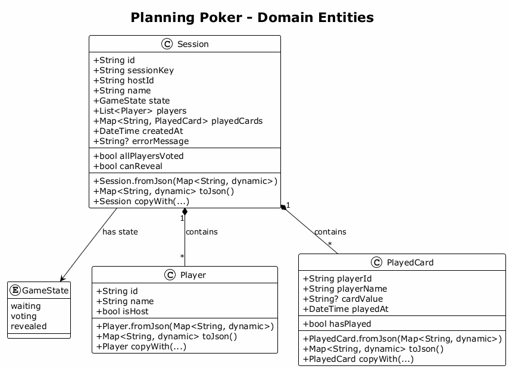

### Camada de Apresentação

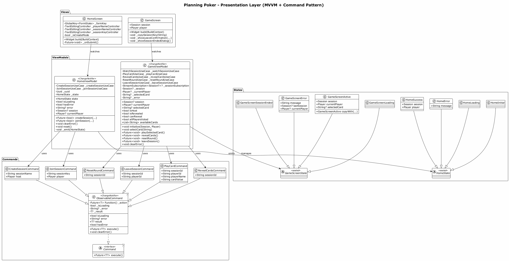

### Camada de Dados

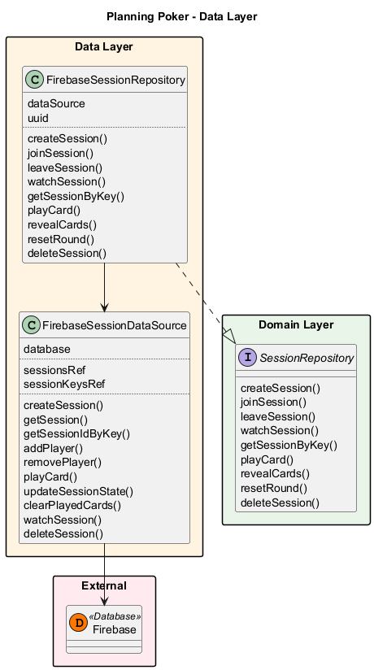

### Casos de Uso

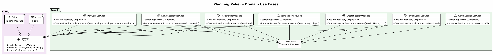

### Fluxos

#### Criar Sessão
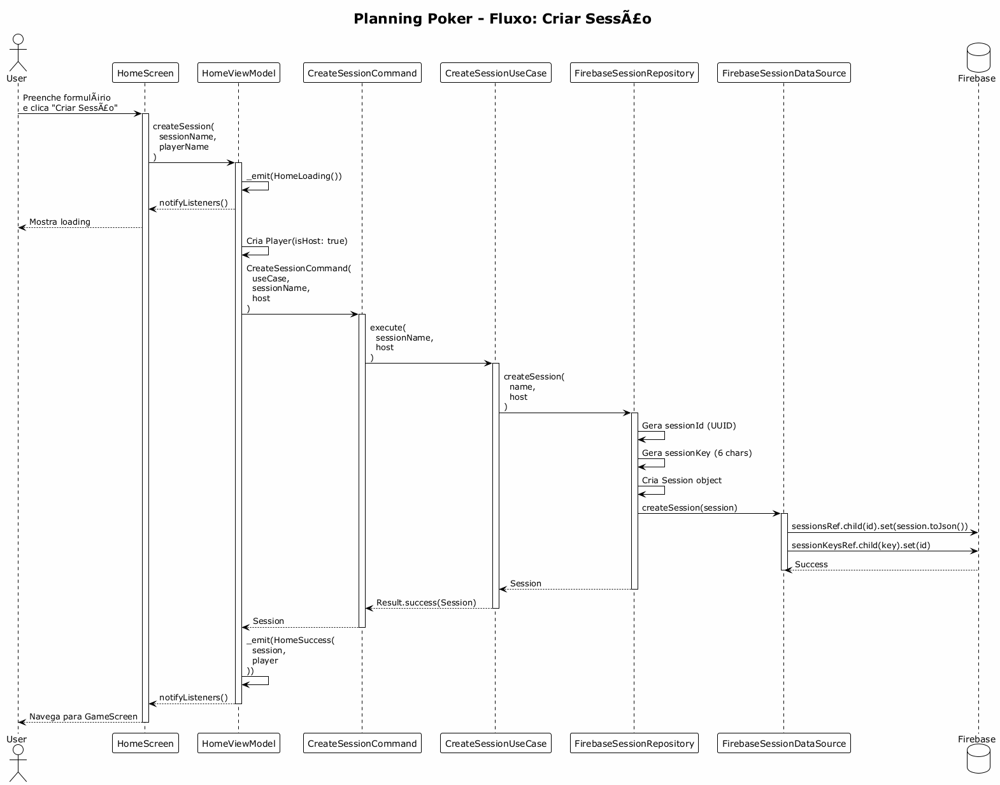

#### Jogar Carta
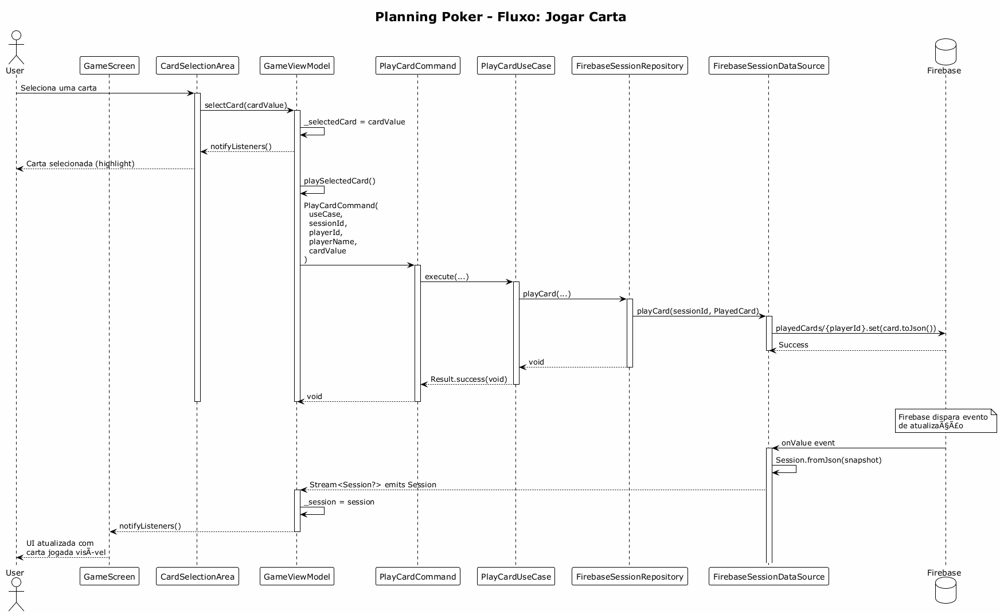

#### Sincronização em Tempo Real
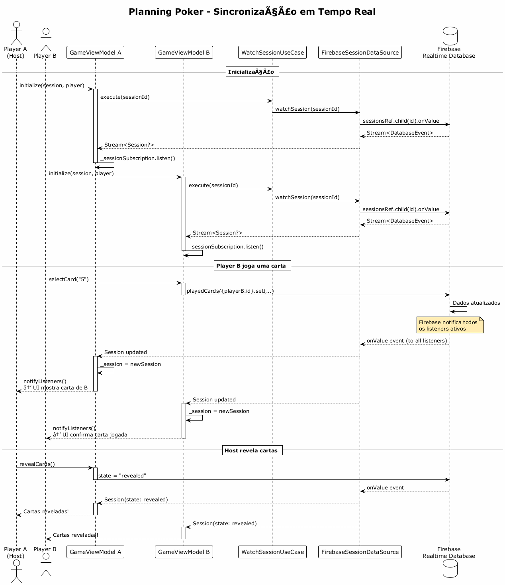

### Máquinas de Estado

#### Home Screen
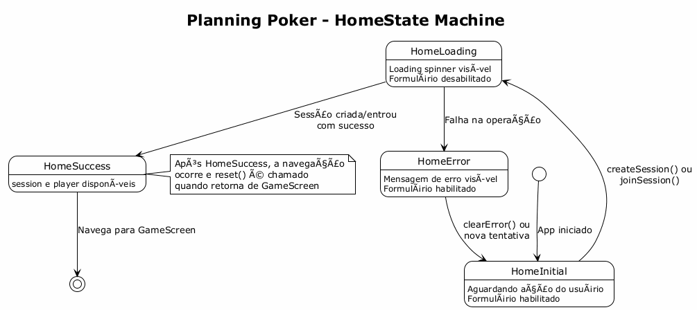

#### Game Screen
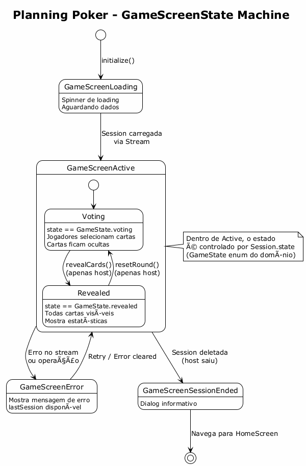

### Injeção de Dependência

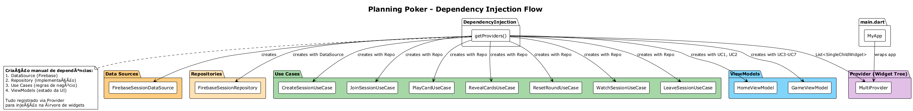

### Estrutura de Pastas

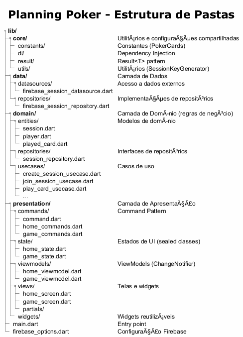

### Gerando Imagens dos Diagramas

```bash
# Usando PlantUML CLI (gera na mesma pasta dos .puml)
java -jar plantuml.jar docs/diagrams/src/*.puml

# Para gerar na pasta images/
java -jar plantuml.jar -o ../images docs/diagrams/src/*.puml

# Ou via extensão VS Code "PlantUML"
```

---

## 🧪 Testes

### Estrutura de Testes
```
test/
├── unit/                    # Testes unitários
│   ├── domain/
│   │   └── usecases/
│   ├── data/
│   │   └── repositories/
│   └── presentation/
│       └── viewmodels/
├── widget/                  # Testes de widget
└── integration/             # Testes de integração
```

### Executando Testes

```bash
# Todos os testes
flutter test

# Com coverage
flutter test --coverage

# Testes específicos
flutter test test/unit/
```

---

## 🔄 Fluxo de Dados

```
┌────────────────────────────────────────────────────────────────┐
│                           USUÁRIO                               │
└─────────────────────────────┬──────────────────────────────────┘
                              │ Interação
                              ▼
┌─────────────────────────────────────────────────────────────────┐
│  VIEW                                                           │
│  - Renderiza UI baseado no State                                │
│  - Chama métodos do ViewModel                                   │
└─────────────────────────────┬───────────────────────────────────┘
                              │ context.read<ViewModel>()
                              ▼
┌─────────────────────────────────────────────────────────────────┐
│  VIEWMODEL                                                      │
│  - Recebe ação da View                                          │
│  - Emite estado de Loading                                      │
│  - Cria e executa Command                                       │
│  - Emite estado de Success/Error                                │
└─────────────────────────────┬───────────────────────────────────┘
                              │ Command.execute()
                              ▼
┌─────────────────────────────────────────────────────────────────┐
│  COMMAND                                                        │
│  - Gerencia loading/error                                       │
│  - Chama UseCase                                                │
│  - Retorna Result                                               │
└─────────────────────────────┬───────────────────────────────────┘
                              │ useCase.execute()
                              ▼
┌─────────────────────────────────────────────────────────────────┐
│  USE CASE                                                       │
│  - Contém regra de negócio                                      │
│  - Chama Repository                                             │
│  - Retorna Result<T>                                            │
└─────────────────────────────┬───────────────────────────────────┘
                              │ repository.method()
                              ▼
┌─────────────────────────────────────────────────────────────────┐
│  REPOSITORY                                                     │
│  - Implementa interface do domínio                              │
│  - Usa DataSource                                               │
│  - Converte dados                                               │
└─────────────────────────────┬───────────────────────────────────┘
                              │ dataSource.method()
                              ▼
┌─────────────────────────────────────────────────────────────────┐
│  DATASOURCE                                                     │
│  - Acessa Firebase                                              │
│  - CRUD operations                                              │
│  - Streams para tempo real                                      │
└─────────────────────────────┬───────────────────────────────────┘
                              │
                              ▼
                    ┌─────────────────┐
                    │    FIREBASE     │
                    │ Realtime Database│
                    └─────────────────┘
```

---

## 🤝 Contribuição

1. Fork o projeto
2. Crie sua feature branch (`git checkout -b feature/AmazingFeature`)
3. Commit suas mudanças (`git commit -m 'Add some AmazingFeature'`)
4. Push para a branch (`git push origin feature/AmazingFeature`)
5. Abra um Pull Request

---

## 📝 Licença

Este projeto está sob a licença MIT. Veja o arquivo [LICENSE](LICENSE) para mais detalhes.

---

## 👤 Autor

**Daniel Brown**

- GitHub: [@DanielBrown1998](https://github.com/DanielBrown1998)

---

<p align="center">
  Feito com ❤️ e ☕ usando Flutter
</p>
